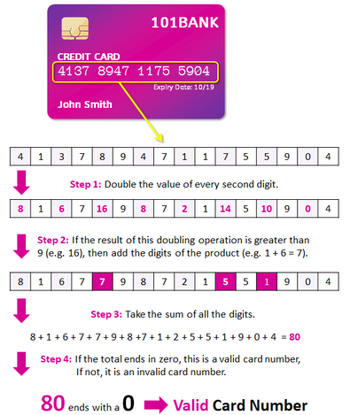
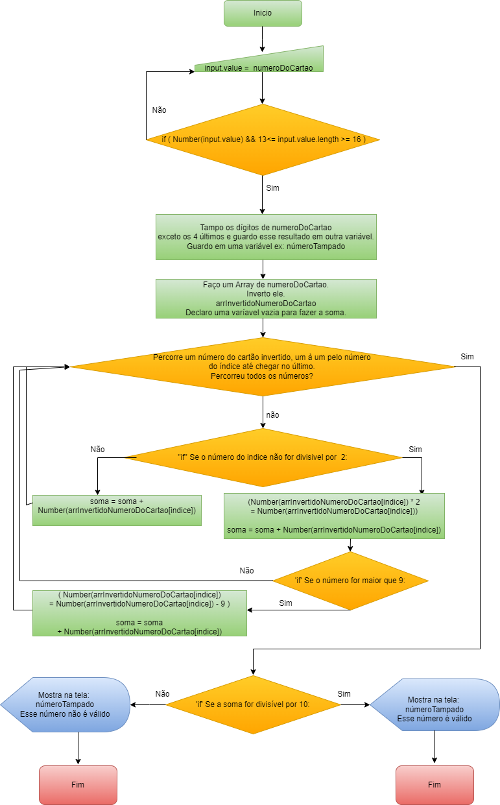
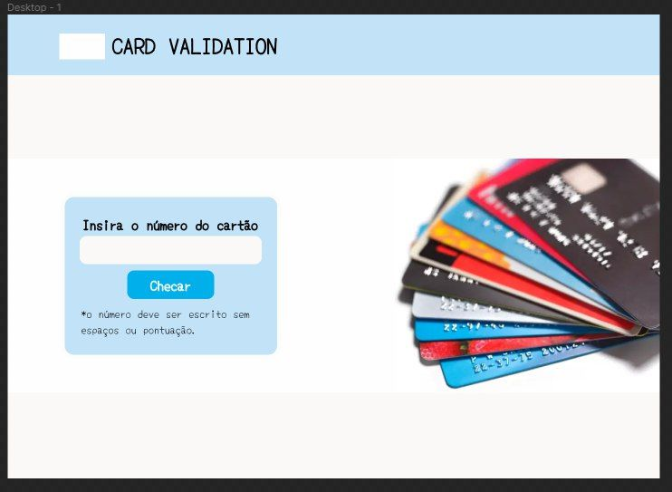
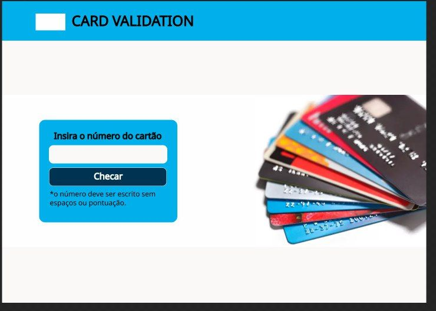
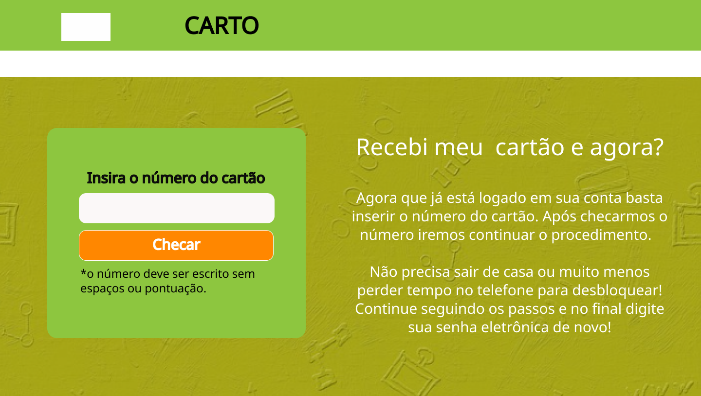

# Cartão de Crédito Válido

## Índice

- [1. Introdução](#1-Introdução)
- [2. Resumo do projeto](#2-resumo-do-projeto)
- [3. Considerações gerais](#3-consideracoes-gerais)
- [4. Considerações técnicas](#4-considerações-técnicas)
- [5. Deploy do Projeto e como utilizar](#5-guias-dicas-e-leituras-complementares)
- [6. Checklist](#9-checklist)

---

## 1. Introdução

O [algoritmo de Luhn](https://en.wikipedia.org/wiki/Luhn_algorithm), também
chamado de módulo 10, é um método de soma de verificação, usado para validar
números de identificação, como o IMEI de telefones celulares, cartões de crédito
etc.

Esse algoritmo é simples. Obtemos o inverso do número a ser verificado (que
contém apenas dígitos [0-9]); todos os números que ocupam uma posição par devem
ser multiplicados por dois; se esse número for maior ou igual a 10, devemos
adicionar os dígitos do resultado; o número a verificar será válido se a soma de
seus dígitos finais for um múltiplo de 10.

---

## 2. Resumo do projeto
O objetivo do projeto é criar um aplicativo da Web que permita ao usuário validar 
o número de um cartão de crédito. Além disso, esse aplicativo web também terá a 
funcionalidade para ocultar todos os dígitos de um cartão, exceto os quatro últimos.

Este é o fluxograma inicial do projeto: 

---

## 3. Considerações gerais

O projeto foi realizado durante o período do bootcamp da Laboratória, tendo como 
objetivo o desenvolvimento de um app Web com Vanilla Js, HTML e CSS. Era necessário 
também criar um contexto para o projeto.

### Definição do produto

Como o projeto em si era criar um validador de cartões com a lógica de LUHN, veio 
como ideia que esse validador deveria ser utilizado em bancos. Porém em qual 
contexto? Após algumas horas de pesquisas para conhecer os usuários de bancos o 
projeto se encaixou como um dos processos que precisam ser feitos para desbloquear 
um cartão. 

Quando o usuário irá desbloquear um cartão novo que recebeu, é necessário que o 
banco valide o número desse cartão que a pessoa está digitando para só depois o 
processo de desbloqueio do mesmo começar a acontecer, com alguns outros passos 
que não serão abordados nesse projeto. 

Portanto os principais usuários desse projeto seriam os clientes de bancos, com 
o objetivo de desbloquear seu cartão novo, para assim poderem usar o mesmo sem a 
necessidade de sairem de suas casas ou de ligarem para a instituição para realizar 
o procedimento.

### Interface do usuário (UI)

A interface permite ao usuário:

- Inserir o número que desejamos validar.
- Constatar se o resultado é válido ou não.
- Ocultar todos os dígitos do número do cartão, exceto os últimos 4
  caracteres.
- Não aceita campo vazio ou com outros caracteres que não sejam de 0 - 9.

### UX (Design da experiência do usuário)

Meus protótipos foram criados no [Figma](https://www.figma.com/). Os feedbacks 
foram realizados por 5 pessoas, sendo duas alunas da Laboratória. 

Como a proposta era ambientar o projeto para um site de banco, fiz minha pesquisa 
de cores entrando em alguns sites para poder me inspirar. Queria uma visualização 
limpa e prática pois, o que um cliente de banco busca é um serviço rápido e seguro.  

O primeiro protótipo teve feedbacks apontando o tipo de fonte e a cor clara, que de
acordo com possíveis usuários desse projeto, lembravam mais a um blog do que a um 
site de banco.

O segundo protótipo teve mais feedbacks positivos, onde apontavam a seriedade que a 
fonte passava e que a cor mais forte os ambientavam em um site de banco.

No terceiro protótipo a cor foi escolhida após pesquisas em relação as sensações 
que ela transmite ao usuário. O verde pode transmitir segurança e a sensação de algo 
digital, que era a ideia que pretendia passar ao desbloquear o cartão sem precisar sair
de casa ou ligar pelo telefone.

### Scripts / Arquivos

- `REAME.md`: deve explicar como "deployar", instalar e executar a aplicação,
  assim como uma introdução a aplicação, suas funcionalidades e as decisões que
  foram tomadas.

---